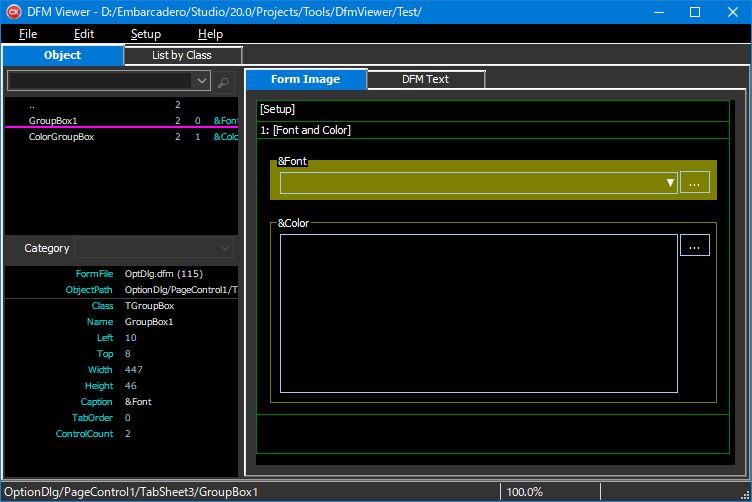

# DFM Viewer

## Overview
DFM Viewer can check objects in DFM (Delphi form file for C++Builder), display forms in brief, or list objects by class.

## Usage
**DfmViewer.exe** `[<directory\>|<dfm_file_name>]`  
If no parameter is specified, the current directory is used.  

## Key Operation
It is possible to to move the cursor or change focus uning the hjkl keys as arrow keys.  

## Development Environment
C++Builder 10.3.2
